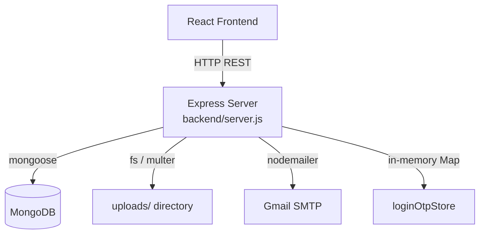

# Design Document: Backend MongoDB Migration

## Overview

This migration replaces the MySQL/mysql2 database layer in `backend/server.js` with MongoDB via the Mongoose ODM. The goal is a drop-in replacement: every HTTP endpoint, request contract, and JSON response shape stays identical so the React frontend requires zero changes.

Key changes:
- Remove `mysql2` import and connection pool; add `mongoose` connection on startup
- Replace raw SQL queries with Mongoose model operations
- Remove dynamic schema-detection helpers (`getTableColumns`, `getUserSchemaConfig`, `buildUserSelectFields`, `tableColumnsCache`)
- Map MongoDB `_id` → `id` (string) in all responses that previously returned a numeric `id`
- Replace four MySQL env vars with a single `MONGODB_URI`

## Architecture



The server remains a single-file Express application. Mongoose models are defined inline at the top of the file, replacing the MySQL pool. All business logic and routing stays in the same file.

## Components and Interfaces

### Connection Bootstrap

```js
import mongoose from 'mongoose';

mongoose.connect(process.env.MONGODB_URI)
  .then(() => console.log('MongoDB connected'))
  .catch(err => console.error('MongoDB connection error:', err));
```

### Mongoose Models

Seven models replace the seven MySQL tables. Each model is defined with `mongoose.model()` and exported inline.

| Model | Collection | Key fields |
|---|---|---|
| `User` | `users` | fullname, email (unique), password, role, profile_photo |
| `StudentProfile` | `studentprofiles` | user_id (ref User), bio, degree, branch, year, cgpa, skills, projects[], internships[], achievements[] |
| `AlumniProfile` | `alumniprofiles` | user_id (ref User), bio, designation, company, experience, linkedin, github, skills, achievements[] |
| `Job` | `jobs` | title, description, location, company, alumni_id (ref User), alumni_name, status, created_at |
| `Post` | `posts` | author_id (ref User), author_name, author_role, caption, image_path, created_at |
| `Follow` | `follows` | follower_id (ref User), following_id (ref User) — unique compound index |
| `StudentResume` | `studentresumes` | student_id (ref User), resume_path, uploaded_at |

### ID Mapping Helper

A small utility converts Mongoose documents to the response shape the frontend expects:

```js
const toId = (doc) => ({ ...doc.toObject(), id: doc._id.toString() });
```

This is applied wherever a document is returned to the client.

### Removed Helpers

The following MySQL-specific helpers are deleted entirely:
- `getTableColumns(tableName)`
- `getUserSchemaConfig()`
- `buildUserSelectFields(config)`
- `tableColumnsCache` (Map)

### Endpoint Inventory (unchanged paths)

| Method | Path | Handler change |
|---|---|---|
| POST | `/register` | `db.execute INSERT` → `User.create` |
| POST | `/login` | `db.execute SELECT` → `User.findOne` |
| POST | `/api/student/upload-resume` | `db.execute INSERT` → `StudentResume.create` |
| GET | `/api/student/resume/:studentId` | `db.execute SELECT` → `StudentResume.findOne` |
| GET | `/api/admin/users` | `db.query SELECT` → `User.find` |
| POST | `/api/profile/:userId/photo` | `db.execute UPDATE` → `User.findByIdAndUpdate` |
| PUT | `/api/alumni-profile/:userId` | `INSERT ON DUPLICATE KEY` → `AlumniProfile.findOneAndUpdate upsert` |
| GET | `/api/alumni-profile/:userId` | `db.execute SELECT` → `AlumniProfile.findOne` |
| PUT | `/api/profile/:userId` | `INSERT ON DUPLICATE KEY` → `StudentProfile.findOneAndUpdate upsert` |
| GET | `/api/profile/:userId` | `db.execute SELECT` → `StudentProfile.findOne` |
| POST | `/api/posts` | `db.execute INSERT` → `Post.create` |
| GET | `/api/posts` | `db.execute SELECT` → `Post.find` |
| DELETE | `/api/posts/:postId` | `db.execute SELECT+DELETE` → `Post.findById` + `Post.deleteOne` |
| POST | `/api/jobs/post` | `db.execute INSERT` → `Job.create` |
| GET | `/api/jobs/all` | `db.execute SELECT` → `Job.find` |
| PUT | `/api/jobs/:jobId/status` | `db.execute UPDATE` → `Job.findByIdAndUpdate` |
| GET | `/api/jobs/my/:alumniId` | `db.execute SELECT` → `Job.find` |
| POST | `/api/login-otp/send` | `db.execute SELECT` → `User.findOne` (OTP store unchanged) |
| POST | `/api/login-otp/verify` | No DB change (in-memory only) |
| GET | `/api/network/users` | `db.execute SELECT + enrichment` → `User.find + profile lookups` |
| GET | `/api/network/users/:userId` | `db.execute SELECT` → `User.findById + profile lookup` |
| POST | `/api/network/follow` | `INSERT IGNORE` → `Follow.create` with duplicate catch |
| DELETE | `/api/network/follow` | `db.execute DELETE` → `Follow.deleteOne` |
| GET | `/api/network/follow/check` | `db.execute SELECT` → `Follow.findOne` |
| GET | `/api/network/follow/:userId/followers` | `JOIN query` → `Follow.find + User.find` |
| GET | `/api/network/follow/:userId/following` | `JOIN query` → `Follow.find + User.find` |

## Data Models

### User Schema

```js
const userSchema = new mongoose.Schema({
  fullname:      { type: String, required: true },
  email:         { type: String, required: true, unique: true },
  password:      { type: String, required: true },
  role:          { type: String, default: 'Student' },
  profile_photo: { type: String, default: null },
});
const User = mongoose.model('User', userSchema);
```

### StudentProfile Schema

```js
const studentProfileSchema = new mongoose.Schema({
  user_id:      { type: mongoose.Schema.Types.ObjectId, ref: 'User', required: true, unique: true },
  bio:          String,
  degree:       String,
  branch:       String,
  year:         String,
  cgpa:         String,
  skills:       String,
  projects:     { type: Array, default: [] },
  internships:  { type: Array, default: [] },
  achievements: { type: Array, default: [] },
});
const StudentProfile = mongoose.model('StudentProfile', studentProfileSchema);
```

### AlumniProfile Schema

```js
const alumniProfileSchema = new mongoose.Schema({
  user_id:      { type: mongoose.Schema.Types.ObjectId, ref: 'User', required: true, unique: true },
  bio:          String,
  designation:  String,
  company:      String,
  experience:   String,
  linkedin:     String,
  github:       String,
  skills:       String,
  achievements: { type: Array, default: [] },
});
const AlumniProfile = mongoose.model('AlumniProfile', alumniProfileSchema);
```

### Job Schema

```js
const jobSchema = new mongoose.Schema({
  title:       { type: String, required: true },
  description: String,
  location:    { type: String, required: true },
  company:     { type: String, required: true },
  alumni_id:   { type: mongoose.Schema.Types.ObjectId, ref: 'User' },
  alumni_name: String,
  status:      { type: String, default: 'Pending Admin Approval' },
  created_at:  { type: Date, default: Date.now },
});
const Job = mongoose.model('Job', jobSchema);
```

### Post Schema

```js
const postSchema = new mongoose.Schema({
  author_id:   { type: mongoose.Schema.Types.ObjectId, ref: 'User' },
  author_name: String,
  author_role: String,
  caption:     String,
  image_path:  String,
  created_at:  { type: Date, default: Date.now },
});
const Post = mongoose.model('Post', postSchema);
```

### Follow Schema

```js
const followSchema = new mongoose.Schema({
  follower_id:  { type: mongoose.Schema.Types.ObjectId, ref: 'User', required: true },
  following_id: { type: mongoose.Schema.Types.ObjectId, ref: 'User', required: true },
});
followSchema.index({ follower_id: 1, following_id: 1 }, { unique: true });
const Follow = mongoose.model('Follow', followSchema);
```

### StudentResume Schema

```js
const studentResumeSchema = new mongoose.Schema({
  student_id:  { type: mongoose.Schema.Types.ObjectId, ref: 'User', required: true },
  resume_path: { type: String, required: true },
  uploaded_at: { type: Date, default: Date.now },
});
const StudentResume = mongoose.model('StudentResume', studentResumeSchema);
```

### ID Mapping Strategy

MySQL auto-increment integers become MongoDB ObjectId strings. The frontend currently reads `user.id`, `post.id`, `job.jobId`, etc. The mapping rules are:

- All `User` documents: return `_id.toString()` as `id`
- `POST /api/posts` response: `{ post: { id: doc._id.toString(), ... } }`
- `POST /api/jobs/post` response: `{ jobId: doc._id.toString() }`
- `GET /api/posts` response: each post object has `id` mapped from `_id`, `image` mapped from `image_path`
- Network endpoints: each user object has `id` mapped from `_id`

The `alumni_id` field stored in Job documents is an ObjectId; when the frontend sends `alumniId` as a string, it must be cast with `new mongoose.Types.ObjectId(alumniId)` before querying.


## Correctness Properties

*A property is a characteristic or behavior that should hold true across all valid executions of a system — essentially, a formal statement about what the system should do. Properties serve as the bridge between human-readable specifications and machine-verifiable correctness guarantees.*

**Property Reflection:** After reviewing all testable criteria, the following consolidations were made:
- 3.3 (success response shape) is subsumed by Property 1 (registration creates document + returns 200)
- 7.4 (403 response) is subsumed by Property 11 (unauthorized delete returns 403)
- 11.2 and 11.5 (response shapes/status codes) are subsumed by individual endpoint properties
- 9.5 (follow/unfollow round trip) and 9.6 (isFollowing check) are combined into Property 16 (follow state consistency)
- 8.2 and 7.2 (sorted lists) are combined into Property 13 (chronological ordering)

---

### Property 1: Registration creates a User document

*For any* valid combination of `{fullname, email, password, role}`, submitting a `POST /register` request SHALL result in a new `User` document existing in MongoDB with those field values, and the response SHALL be `{ success: true }` with HTTP 200.

**Validates: Requirements 3.1, 3.3**

---

### Property 2: Duplicate email registration is rejected

*For any* email address that already belongs to an existing `User` document, a subsequent `POST /register` request with that same email SHALL return HTTP 400 with `{ success: false, message: "Email already exists" }` and SHALL NOT create a second `User` document.

**Validates: Requirements 3.2**

---

### Property 3: Missing required registration fields are rejected

*For any* registration request that omits at least one of `fullname`, `email`, or `password`, the server SHALL return HTTP 400 with `{ success: false, message: "Fullname, email, and password are required" }` and SHALL NOT create a `User` document.

**Validates: Requirements 3.4**

---

### Property 4: Login with unknown email returns invalid credentials

*For any* email string that does not correspond to an existing `User` document, a `POST /login` request with that email SHALL return HTTP 400 with `{ success: false, message: "Invalid credentials" }`.

**Validates: Requirements 4.2**

---

### Property 5: Login role mismatch returns invalid credentials

*For any* registered user with role `R`, a `POST /login` request providing a different role (excluding the `alumni`/`alumini` alias pair) SHALL return HTTP 400 with `{ success: false, message: "Invalid credentials" }`. Specifically, `alumni` and `alumini` SHALL be treated as equivalent roles.

**Validates: Requirements 4.3, 11.4**

---

### Property 6: Successful login returns id as a string

*For any* registered user with a valid password and matching role, a successful `POST /login` response SHALL include `user.id` as a string equal to the user's MongoDB `_id.toString()`, along with `fullname`, `email`, `role`, and `profile_photo` fields.

**Validates: Requirements 4.4, 11.3**

---

### Property 7: Resume upload creates a StudentResume document

*For any* valid `studentId` (a MongoDB `_id` string) and a valid file (PDF/DOC/DOCX), a `POST /api/student/upload-resume` request SHALL create a `StudentResume` document in MongoDB with `student_id` equal to the provided `studentId` and `resume_path` pointing to the saved file.

**Validates: Requirements 5.1, 5.4**

---

### Property 8: Resume retrieval returns the most recent upload

*For any* student with multiple `StudentResume` documents, a `GET /api/student/resume/:studentId` request SHALL return the `resume_path` of the document with the latest `uploaded_at` timestamp.

**Validates: Requirements 5.2**

---

### Property 9: Profile upsert is idempotent

*For any* `userId` and profile data payload, calling `PUT /api/profile/:userId` (or `PUT /api/alumni-profile/:userId`) twice with the same data SHALL result in exactly one profile document in MongoDB containing the latest submitted values — no duplicate documents SHALL be created.

**Validates: Requirements 6.1, 6.3**

---

### Property 10: Profile array fields are always arrays in responses

*For any* `StudentProfile` document, a `GET /api/profile/:userId` response SHALL have `projects`, `internships`, and `achievements` as JavaScript arrays (never null, undefined, or a raw JSON string). For any `AlumniProfile` document, `achievements` SHALL likewise always be an array.

**Validates: Requirements 6.2, 6.4**

---

### Property 11: Post deletion is authorized by author only

*For any* `Post` document with `author_id` equal to user A, a `DELETE /api/posts/:postId` request with `authorId` equal to any user B where B ≠ A SHALL return HTTP 403 with `{ success: false, message: "Not authorized" }` and SHALL NOT delete the document.

**Validates: Requirements 7.3, 7.4**

---

### Property 12: Post and job creation returns _id as id string

*For any* `POST /api/posts` request, the response SHALL include `post.id` as a string equal to the created document's `_id.toString()`. *For any* `POST /api/jobs/post` request, the response SHALL include `jobId` as a string equal to the created document's `_id.toString()`. *For any* new `Job` document, `status` SHALL equal `'Pending Admin Approval'`.

**Validates: Requirements 7.1, 8.1, 11.3**

---

### Property 13: List endpoints return documents sorted by created_at descending

*For any* set of `Post` documents, `GET /api/posts` SHALL return them ordered so that each document's `created_at` is greater than or equal to the next document's `created_at`. The same ordering invariant SHALL hold for `GET /api/jobs/all` and `GET /api/jobs/my/:alumniId`.

**Validates: Requirements 7.2, 8.2, 8.4**

---

### Property 14: Job filtering by alumniId returns only matching jobs

*For any* `alumniId`, `GET /api/jobs/my/:alumniId` SHALL return only `Job` documents where `alumni_id.toString()` equals `alumniId`. No job belonging to a different alumni SHALL appear in the result.

**Validates: Requirements 8.4**

---

### Property 15: Network user list never exposes password field

*For any* `GET /api/network/users` or `GET /api/network/users/:userId` response, no user object in the response SHALL contain a `password` field.

**Validates: Requirements 9.1**

---

### Property 16: Follow state is consistent with Follow collection

*For any* `(followerId, followingId)` pair, the value of `isFollowing` returned by `GET /api/network/follow/check` SHALL be `true` if and only if a `Follow` document with those exact ids exists in MongoDB. After a `POST /api/network/follow`, `isFollowing` SHALL be `true`. After a `DELETE /api/network/follow`, `isFollowing` SHALL be `false`. Calling `POST /api/network/follow` twice SHALL result in exactly one `Follow` document (idempotent).

**Validates: Requirements 9.4, 9.5, 9.6**

---

### Property 17: Follower and following counts match Follow collection

*For any* user U, the `followers` count returned by `GET /api/network/users/:userId` SHALL equal the number of `Follow` documents where `following_id` equals U's `_id`. The `following` count SHALL equal the number of `Follow` documents where `follower_id` equals U's `_id`.

**Validates: Requirements 9.3**

---

### Property 18: Self-follow is rejected for any userId

*For any* userId, a `POST /api/network/follow` request with `followerId === followingId` SHALL return HTTP 400 with `{ success: false, message: "Cannot follow yourself" }` and SHALL NOT create a `Follow` document.

**Validates: Requirements 9.9**

---

### Property 19: OTP is a 6-digit string with a 10-minute expiry

*For any* valid user email, after a successful `POST /api/login-otp/send`, the OTP stored in `loginOtpStore` SHALL be a string of exactly 6 decimal digits, and its `expiresAt` SHALL be approximately `Date.now() + 600000` ms (within a 1-second tolerance).

**Validates: Requirements 10.1**

---

### Property 20: Invalid status values are rejected for job status updates

*For any* string that is not one of `['approved', 'rejected', 'Pending Admin Approval']`, a `PUT /api/jobs/:jobId/status` request with that string SHALL return HTTP 400 with `{ success: false, message: "Invalid status" }`.

**Validates: Requirements 8.5**

---

## Error Handling

### Database Errors

- All route handlers are wrapped in `try/catch`. Unhandled Mongoose errors return HTTP 500 with `{ success: false, message: "Server error", error: err.message }`.
- Mongoose `CastError` (invalid ObjectId format) should be caught and return HTTP 400 rather than 500 for endpoints that accept `:userId`, `:postId`, `:jobId` params.
- Duplicate key errors (code 11000) on `User.email` and `Follow` compound index are caught and return HTTP 400 with the appropriate message.

### File Upload Errors

- Invalid MIME types return HTTP 400 with a descriptive message before any file is written to disk.
- File move failures (`file.mv`) propagate to the catch block and return HTTP 500.
- On post deletion, missing image files are silently ignored (file may have been manually removed).

### Connection Failure

- If `mongoose.connect` rejects, the error is logged to `console.error`. The server still starts and listens; individual requests will fail with 500 until the connection is restored. This matches the existing MySQL pool behavior.

### ObjectId Casting

When route params like `:userId`, `:studentId`, `:postId`, `:jobId` are used in Mongoose queries, invalid ObjectId strings cause a `CastError`. Each handler should catch this and return HTTP 400 with `{ success: false, message: "Invalid ID format" }`.

---

## Testing Strategy

### PBT Applicability Assessment

This feature has significant pure-logic components (ID mapping, role alias handling, filter logic, OTP generation, authorization checks) that are well-suited to property-based testing. The Mongoose query layer can be tested with an in-memory MongoDB instance (`mongodb-memory-server`) to keep tests fast and free of external dependencies.

### Property-Based Testing

**Library**: `fast-check` (JavaScript PBT library)  
**In-memory DB**: `mongodb-memory-server` for isolated, fast Mongoose tests  
**Minimum iterations**: 100 per property test

Each property test is tagged with:
```
// Feature: backend-mongodb-migration, Property N: <property_text>
```

Properties to implement as PBT tests (using `fc.assert` + `fc.asyncProperty`):

| Property | Arbitraries |
|---|---|
| P1: Registration creates document | `fc.record({ fullname: fc.string({minLength:1}), email: fc.emailAddress(), password: fc.string({minLength:1}), role: fc.constantFrom('Student','Alumni') })` |
| P2: Duplicate email rejected | `fc.emailAddress()` — register once, register again |
| P3: Missing fields rejected | `fc.subarray(['fullname','email','password'], {minLength:1})` — omit each subset |
| P4: Unknown email → 400 | `fc.emailAddress()` not in DB |
| P5: Role mismatch → 400 | `fc.constantFrom('Student','Alumni','Alumini')` pairs |
| P6: Login returns id as string | Any registered user |
| P7: Resume upload creates document | `fc.uuid()` as studentId, mock file |
| P8: Resume returns most recent | Multiple uploads with varying timestamps |
| P9: Profile upsert idempotent | `fc.record(...)` for profile fields |
| P10: Array fields always arrays | Any profile document |
| P11: Delete unauthorized → 403 | Two distinct user ids |
| P12: Post/job id is string | Any post/job creation payload |
| P13: Lists sorted descending | `fc.array(fc.date(), {minLength:2})` for created_at values |
| P14: Job filter by alumniId | Multiple alumni, multiple jobs |
| P15: No password in network response | Any set of users |
| P16: Follow state consistency | Any (followerId, followingId) pair |
| P17: Follower/following counts | Any user with N followers |
| P18: Self-follow rejected | Any userId |
| P19: OTP is 6-digit string | Any valid user email |
| P20: Invalid status rejected | `fc.string()` filtered to exclude valid values |

### Unit Tests (Example-Based)

- Admin hardcoded login bypass (Requirement 4.5)
- OTP expiry returns 400 (Requirement 10.3)
- No resume found returns `{ success: false, message: "No resume uploaded yet!" }` (Requirement 5.3)
- Profile not found returns `{ success: true, profile: null }` (Requirement 6.5)
- Post with image: deleting removes file from disk (Requirement 7.5)
- Profile photo upload updates User document (Requirement 6.6)

### Integration Tests

- Server connects to MongoDB using `MONGODB_URI` (Requirement 1.1) — single smoke test with real connection string
- All route paths and HTTP methods match the original API contract (Requirement 11.1) — enumerate registered routes

### Test File Structure

```
backend/
  __tests__/
    unit/
      auth.test.js        # P1-P6, admin bypass, OTP
      resume.test.js      # P7-P8
      profile.test.js     # P9-P10, photo upload
      posts.test.js       # P11-P13 (posts)
      jobs.test.js        # P12-P14, P20
      network.test.js     # P15-P18
    integration/
      connection.test.js  # smoke: MongoDB connection
      routes.test.js      # API contract preservation
```
