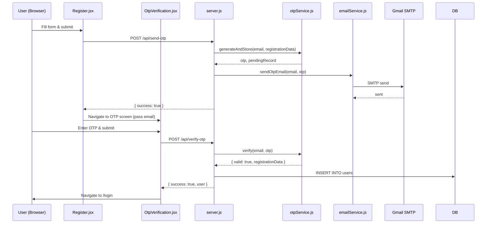

# Design Document: Mail OTP Registration

## Overview

This feature adds email OTP (One-Time Password) verification to the CampusBridge registration flow. Instead of creating a user account immediately on form submission, the backend holds the registration data in memory, sends a 6-digit OTP to the submitted email, and only creates the account once the user successfully verifies the OTP.

The implementation touches three layers:
- A new `otpService.js` module managing in-memory OTP state
- A new `emailService.js` module wrapping Nodemailer/Gmail
- Two new API endpoints in `server.js`
- A new `OtpVerification.jsx` frontend component
- Updates to `Register.jsx` to gate account creation behind OTP

Key constraints from requirements:
- All roles must use `@rmcet.com` email domain
- OTP: 6-digit numeric, 10-minute expiry, 5-attempt limit, 60s resend cooldown
- Pending registrations stored in a server-side `Map` (no DB writes until verified)
- Email sent via Nodemailer with Gmail App Password

---

## Architecture



The frontend uses React Router state to pass the email (and no sensitive data) from `Register.jsx` to `OtpVerification.jsx`. The backend is stateless per-request; all OTP state lives in the module-level `pendingRegistrations` Map.

---

## Components and Interfaces

### Backend: `backend/services/otpService.js`

```js
// In-memory store: email -> PendingRecord
const pendingRegistrations = new Map();

// PendingRecord shape:
// {
//   otp: string,           // 6-digit string
//   registrationData: object,
//   createdAt: number,     // Date.now()
//   attemptsLeft: number,  // starts at 5
// }

generateAndStore(email, registrationData) -> string  // returns OTP
verify(email, submittedOtp) -> { valid, error?, registrationData? }
invalidate(email) -> void
replace(email, registrationData) -> string           // for resend
```

### Backend: `backend/services/emailService.js`

```js
// Wraps nodemailer transporter configured with Gmail App Password
sendOtpEmail(toEmail, otp) -> Promise<void>
```

### Backend: New endpoints in `server.js`

| Method | Path | Description |
|--------|------|-------------|
| POST | `/api/send-otp` | Validates inputs, checks for duplicate email, generates OTP, sends email |
| POST | `/api/verify-otp` | Validates OTP, creates user account on success |

### Frontend: `frontend/src/components/ui/authentication/OtpVerification.jsx`

Props/state:
- Receives `email` via React Router `location.state`
- Local state: `otp` (string), `error` (string), `loading` (bool), `cooldown` (number)
- Calls `POST /api/verify-otp` on submit
- Calls `POST /api/send-otp` on resend (re-uses same endpoint)
- Navigates to `/login` on success

### Frontend: Updates to `Register.jsx`

- Domain validation extended to ALL roles (currently only Student)
- On successful `POST /api/send-otp` response, navigate to `/otp-verification` with `{ state: { email } }`
- Remove direct `POST /register` call (account creation moves to verify-otp endpoint)

---

## Data Models

### PendingRecord (in-memory only)

```js
{
  otp: "482931",              // 6-digit zero-padded string
  registrationData: {
    fullname: string,
    email: string,
    password: string,         // stored as-is; hashing is out of scope
    phoneNumber: string|null,
    role: string,
    profilePhotoPath: string|null,
  },
  createdAt: 1700000000000,   // Unix ms timestamp
  attemptsLeft: 5,
}
```

The Map key is the lowercase email address. No DB table is created for pending registrations.

### API Request/Response Shapes

**POST /api/send-otp**
```
Request body (multipart/form-data):
  fullname, email, password, phoneNumber, role, profile_photo (file, optional)

Response 200: { success: true, message: "OTP sent to <email>" }
Response 400: { success: false, message: "Email already registered" }
Response 400: { success: false, message: "<validation error>" }
Response 500: { success: false, message: "Failed to send OTP email" }
```

**POST /api/verify-otp**
```
Request body (JSON):
  { email: string, otp: string }

Response 200: { success: true, message: "Registration successful", user: { id, fullname, email, role, profile_photo } }
Response 400: { success: false, message: "Invalid OTP. X attempts remaining." }
Response 400: { success: false, message: "OTP expired. Please register again." }
Response 400: { success: false, message: "Too many attempts. Please register again." }
Response 400: { success: false, message: "No pending registration found for this email." }
Response 500: { success: false, message: "Server error" }
```

---

## Correctness Properties

*A property is a characteristic or behavior that should hold true across all valid executions of a system — essentially, a formal statement about what the system should do. Properties serve as the bridge between human-readable specifications and machine-verifiable correctness guarantees.*

### Property 1: OTP format invariant

*For any* call to `generateAndStore`, the returned OTP SHALL be exactly 6 characters long and consist entirely of numeric digits (0–9), including zero-padded values.

**Validates: Requirements 1.2**

---

### Property 2: Pending registration round-trip

*For any* valid registration payload, after calling `generateAndStore(email, data)`, retrieving the pending record for that email from the Map SHALL contain the original registration data, a valid OTP, a `createdAt` timestamp, and `attemptsLeft` equal to 5.

**Validates: Requirements 1.4**

---

### Property 3: Correct OTP verification succeeds

*For any* pending registration where the stored OTP is submitted within the expiry window, `verify(email, otp)` SHALL return `{ valid: true }` and the pending record SHALL be removed from the Map.

**Validates: Requirements 2.2**

---

### Property 4: Wrong OTP decrements attempt count

*For any* pending registration with N attempts remaining (N > 1), submitting an incorrect OTP SHALL result in the pending record having exactly N-1 attempts remaining and `verify` returning an error response.

**Validates: Requirements 2.3**

---

### Property 5: Domain restriction applies to all roles

*For any* email address that does not end with `@rmcet.com` and *for any* role value (Student, Alumini, Admin), the `Register.jsx` form submission SHALL be blocked and a domain restriction message SHALL be displayed.

**Validates: Requirements 4.3**

---

### Property 6: OTP input validation rejects non-6-digit-numeric strings

*For any* string that is not exactly 6 numeric digits (e.g., contains letters, is shorter/longer, contains spaces), the `OtpVerification.jsx` form SHALL reject submission and display a validation error.

**Validates: Requirements 4.4**

---

### Property 7: Resend replaces pending registration

*For any* email with an existing pending registration, calling `replace(email, newData)` (triggered by resend) SHALL result in exactly one entry in the Map for that email, with a fresh OTP, `attemptsLeft` reset to 5, and a new `createdAt` timestamp.

**Validates: Requirements 3.1, 5.3**

---

## Error Handling

| Scenario | Backend Response | Frontend Behavior |
|---|---|---|
| Email already in `users` table | 400 `"Email already registered"` | Show error on Register form, stay on form |
| Email send failure (SMTP error) | 500 `"Failed to send OTP email"` | Show error on Register form, stay on form |
| Wrong OTP, attempts > 1 | 400 `"Invalid OTP. X attempts remaining."` | Show inline error on OTP screen |
| Wrong OTP, attempts exhausted | 400 `"Too many attempts. Please register again."` | Show error, navigate back to `/register` |
| OTP expired | 400 `"OTP expired. Please register again."` | Show error, navigate back to `/register` |
| No pending record found | 400 `"No pending registration found for this email."` | Show error, navigate back to `/register` |
| DB insert failure on verify | 500 `"Server error"` | Show generic error on OTP screen |
| Missing required fields | 400 `"<field> is required"` | Blocked client-side before API call |

The `pendingRegistrations` Map is never persisted. A server restart clears all pending registrations; users would need to restart the registration flow.

---

## Testing Strategy

### Unit Tests (example-based)

- `otpService`: correct OTP verified → user created; expired OTP → error; exhausted attempts → invalidation; resend → replacement
- `emailService`: mock Nodemailer transport, assert `sendMail` called with correct `to` and body containing OTP
- `Register.jsx`: empty fields blocked; invalid email format blocked; non-@rmcet.com domain blocked for each role
- `OtpVerification.jsx`: non-6-digit input rejected; resend button disabled during cooldown; success navigates to `/login`

### Property-Based Tests

Using **fast-check** (JavaScript PBT library) with minimum **100 iterations** per property.

Each test is tagged with a comment in the format:
`// Feature: mail-otp-registration, Property <N>: <property_text>`

- **Property 1** — Generate arbitrary strings via `fc.string()`, call `generateAndStore`, assert result matches `/^\d{6}$/`
- **Property 2** — Generate arbitrary registration payloads via `fc.record(...)`, call `generateAndStore`, assert Map entry shape
- **Property 3** — Generate valid pending records, call `verify` with matching OTP before expiry, assert success and Map cleanup
- **Property 4** — Generate pending records with `attemptsLeft` in [2..5], submit wrong OTP, assert `attemptsLeft` decremented by 1
- **Property 5** — Generate emails with arbitrary domains (excluding `@rmcet.com`) and arbitrary role values, assert form blocks submission
- **Property 6** — Generate arbitrary strings that are not exactly 6 numeric digits, assert OTP form rejects them
- **Property 7** — Generate two sequential registration payloads for the same email, assert Map has exactly one entry after second call

### Integration Tests

- `POST /api/send-otp` with mocked DB (email exists) → 400 with correct message, `sendMail` not called
- `POST /api/send-otp` with mocked DB (email free) + mocked Nodemailer → 200, Map has entry
- `POST /api/verify-otp` with matching OTP → 200, DB insert called, Map entry removed
- End-to-end: send-otp → verify-otp → assert user row in test DB
